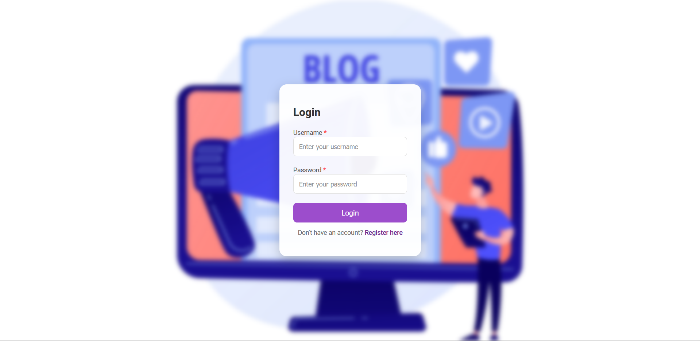
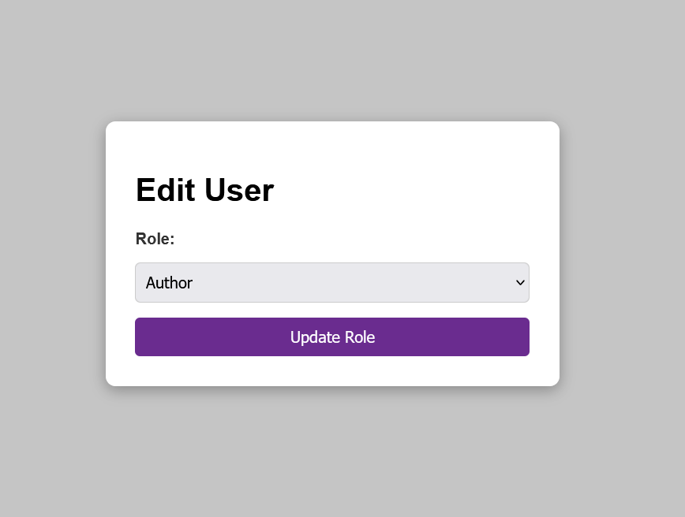

# Blog Content Management System

## Description

The **Blog Content Management System (CMS)** is an intuitive platform designed to streamline the creation, management, and publication of blog articles. It provides tools for authors, editors, and administrators to efficiently manage blog content while fostering an engaging experience for readers. The CMS supports diverse topics such as lifestyle, technology, travel, and wellness, offering features tailored to enhance workflow and content discoverability.

---

## Key Features

1. **User-Friendly Interface**
   - Intuitive and visually appealing UI for seamless navigation.
   - Simplified access to tools for content creation, editing, and management.

2. **Role-Based Access Control (RBAC)**
   - User roles: Admin, Author, Reader.
   - Granular permissions ensure appropriate access for each role.

3. **Content Creation and Editing Tools**
   - Rich text editor with multimedia support.
   - Easy formatting and image uploads for visually engaging content.

4. **Post Management**
   - Tools for drafting, editing, and publishing blog posts.
   - Publish status options: Draft, Pending, Published.

5. **Comment Moderation**
   - Built-in comment system with moderation capabilities.
   - Encourage meaningful reader engagement while maintaining a respectful environment.

6. **Categorization and Tagging**
   - Organize content using categories and tags.
   - Improve discoverability with related topics and tags.

7. **Responsive Design**
   - Fully mobile-friendly for access across desktops, tablets, and smartphones.
   - Manage content on-the-go with a responsive interface.

---

## Primary Goals

- **Efficient Content Management**: Simplify content drafting, editing, and publishing.
- **User Interaction**: Foster community engagement through a comment system.
- **Administrative Control**: Provide tools for admins to manage site activity and user roles.

---

## User Roles and Permissions

| Role   | Permissions                                                                 |
|--------|-----------------------------------------------------------------------------|
| Admin  | Full access to all features. Manage users, approve/reject comments and blogs|
| Author | Create, edit, and publish their own blog posts.                             |
| Reader | View blog posts, leave comments, and interact with other readers.           |

---

## Screenshots

Below are screenshots showcasing the features and functionality of the system:

| Screenshot 1                                   | Screenshot 2                                   |
|------------------------------------------------|------------------------------------------------|
|    |    |

| Screenshot 3                                   | Screenshot 4                                   |
|------------------------------------------------|------------------------------------------------|
|    |    |

| Screenshot 5                                   | Screenshot 6                                   |
|------------------------------------------------|------------------------------------------------|
|    |    |

| Screenshot 7                                   | Screenshot 8                                   |
|------------------------------------------------|------------------------------------------------|
|    |    |

| Screenshot 9                                   | Screenshot 10                                  |
|------------------------------------------------|------------------------------------------------|
|    |  |

---

## Installation and Usage

1. Clone the repository:
   ```bash
   git clone https://github.com/your-repo/blog-cms.git
   cd blog-cms
   
2. Follow the instructions given in the [requirements.txt](requirements.txt) file.
3. Access the CMS at http://localhost:8080/blog_cms/

## Technologies Used

- **Backend**: PHP 
- **Frontend**: HTML, CSS, JavaScript  
- **Database**: MySQL (MariaDB-phpMyAdmin)
- **Other Tools**: Bootstrap, AJAX  

---

## License

This project is licensed under the [MIT License](LICENSE).

---

## Contributors

- **Tatwadarshi** - Developer


